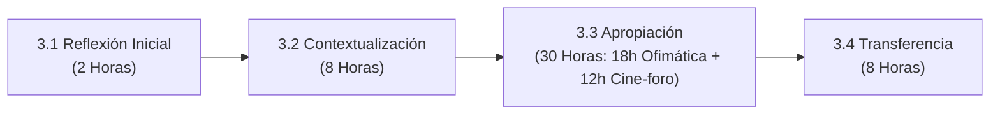

# 1. Identificación de la Guía de Aprendizaje y 2. Presentación

> **Código de formato institucional:** GFPI-F-135 V04  
> **Proceso:** Proceso de Gestión de Formación Profesional Integral  
> **Documento:** Formato Guía de Aprendizaje  

---

## 1. Identificación de la Guía de Aprendizaje

* **Denominación del Programa de Formación:** Análisis y desarrollo de software.
* **Código del Programa de Formación:** 228118.
* **Nombre del Proyecto Formativo (si aplica):** Desarrollo de software orientado a servicios V2.
* **Fase del Proyecto (si aplica):** Análisis.
* **Actividad de Proyecto Formativo (si aplica):** Determinar las especificaciones funcionales del software.
* **Competencia:** Utilizar herramientas informáticas de acuerdo con las necesidades de manejo de información (Código de Norma: **220501046 - TIC**).
* **Resultados de Aprendizaje (RAPs):**
  1. **593154-01:** Alistar herramientas de Tecnologías de la Información y la Comunicación (TIC), de acuerdo con las necesidades de procesamiento de información y comunicación.
  2. **593151-02:** Aplicar funcionalidades de herramientas y servicios TIC, de acuerdo con manuales de uso, procedimientos establecidos y buenas prácticas.
  3. **593153-03:** Evaluar los resultados, de acuerdo con los requerimientos.
  4. **593152-04:** Optimizar los resultados, de acuerdo con la verificación.
* **Duración total de la Guía de Aprendizaje:** 48 horas.

---

## 2. Presentación y Justificación Metodológica

La presente guía de aprendizaje orienta el desarrollo de la competencia transversal **“Utilizar herramientas informáticas de acuerdo con las necesidades de manejo de información”**, correspondiente a la norma **220501046 - TIC** del programa de formación *Análisis y Desarrollo de Software*.

Su propósito fundamental es que el aprendiz **aliste, aplique, evalúe y optimice** el uso de herramientas y servicios TIC como base transversal indispensable para determinar las especificaciones funcionales del software en el proyecto formativo.

### Alcance Temático Integrado
Durante el desarrollo de esta guía, el aprendiz:
* Reconocerá la historia de la computación y la arquitectura del computador (hardware y software, CPU, memoria principal, placa base y buses).
* Clasificará los periféricos de entrada, salida y mixtos.
* Comparará las tecnologías de almacenamiento disponibles (HDD, SSD SATA, factor de forma M.2, protocolo NVMe y las generaciones de bus PCI Express).
* Identificará los tipos de software y los pilares de un sistema operativo.
* Aplicará herramientas ofimáticas y servicios de Internet y conectividad.
* Evaluará los resultados obtenidos mediante el análisis de un caso de innovación tecnológica.
* Optimizará una propuesta de solución tecnológica frente a una problemática real del entorno comunitario.

### Distribución Horaria de las Actividades
La guía comprende **48 horas** de formación estructuradas de forma secuencial y progresiva:

> [!NOTE]  
> El dominio de las herramientas TIC en el análisis y desarrollo de software va mucho más allá del uso operativo elemental de un computador: implica reconocer la tecnología disponible con criterio de ingeniería, aplicarla siguiendo manuales y buenas prácticas, evaluar si responde a los requerimientos del cliente, y optimizarla a partir de la verificación técnica continua.
