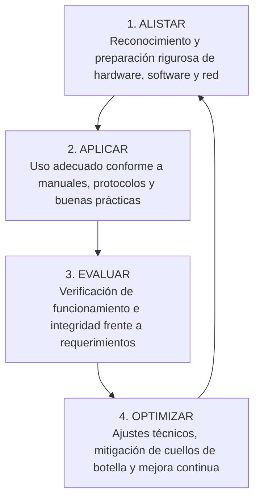

# 3.1 Actividad de Reflexión Inicial (Guía y Desarrollo Resuelto)

> **Programa:** Análisis y Desarrollo de Software (ADSO) - Ficha 228118  
> **Proyecto Formativo:** Desarrollo de software orientado a servicios V2  
> **Fase:** Análisis | **Actividad de Proyecto:** Determinar las especificaciones funcionales del software  
> **Competencia:** 220501046 - TIC (Utilizar herramientas informáticas de acuerdo con las necesidades de manejo de información)  
> **Duración estimada:** 2 horas | **Formato Institucional:** GFPI-F-135 V04  

---

# PARTE I: LINEAMIENTOS INSTITUCIONALES DE LA GUÍA

### Descripción de la Actividad
El instructor presenta el caso de una persona que, al no reconocer los equipos y servicios TIC disponibles, eligió una herramienta inadecuada para procesar la información de su proyecto y perdió tiempo y datos que hubiera podido evitar con un alistamiento previo.

A partir de esta situación, los aprendices, organizados en equipos, responden preguntas orientadoras como:
* ¿Qué diferencia hay entre hardware y software, y por qué es importante reconocerla antes de empezar a trabajar?
* ¿Qué riesgos se corren al usar un equipo, periférico o servicio TIC sin conocer sus funcionalidades?
* ¿Cómo afecta el tipo de almacenamiento o de conexión a Internet disponible el resultado de una tarea de procesamiento de información?

Cada equipo socializa sus respuestas y construye una conclusión grupal sobre la importancia de alistar, aplicar, evaluar y optimizar el uso de las herramientas TIC.

### Entorno y Recursos
* **Ambiente requerido:** Ambiente de formación con tablero, computador, video beam o pantalla, conexión a internet y espacio para trabajo colaborativo en equipos.
* **Estrategias o técnicas didácticas activas:** Lluvia de ideas, análisis de situación problema, trabajo colaborativo, preguntas orientadoras y socialización grupal.
* **Materiales de formación:** Guía de aprendizaje, computador, tablero, marcadores, cuaderno de apuntes y herramientas digitales para registro de ideas.
* **Material de apoyo:** Presentación introductoria sobre Tecnologías de la Información y la Comunicación, caso problema propuesto por el instructor.

---

# PARTE II: DESARROLLO Y RESOLUCIÓN COMPLETA DE LA ACTIVIDAD

## 1. Análisis Técnico del Caso Situacional

### Descripción del Caso Problema
> *Un profesional encargado del levantamiento de requisitos para un sistema de software corporativo decidió registrar la información en una hoja de cálculo almacenada en una unidad externa USB mecánica y defectuosa, operando de forma aislada y sin respaldos en la nube. Durante una sesión de consolidación con múltiples analistas, el archivo se sobreescribió accidentalmente, la unidad USB sufrió daño por desconexión en caliente y más de 3 semanas de trabajo de especificación funcional se perdieron irremediablemente.*

### Diagnóstico de Fallas de Alistamiento
1. **Inadecuada selección de software para trabajo concurrente:** Se empleó una aplicación ofimática monousuario local en lugar de un sistema de gestión documental con control de versiones (Git/Markdown, Confluence o Jira).
2. **Omisión de principios de redundancia de almacenamiento:** No se aplicó la regla básica de respaldo **3-2-1** (3 copias de los datos, en 2 medios distintos, 1 de ellos fuera del sitio/nube).
3. **Desconocimiento operativo del hardware:** Se manipuló una unidad de almacenamiento externa sin desmontaje seguro lógico, corrompiendo la tabla de asignación de archivos (FAT/NTFS).

---

## 2. Respuestas Fundamentadas a las Preguntas Orientadoras

### Pregunta 1: ¿Qué diferencia hay entre hardware y software, y por qué es importante reconocerla antes de empezar a trabajar?

* **Diferencia Fundamental:**
  * **Hardware:** Constituye la estructura física, tangible y electromecánica del sistema computacional. Incluye el microprocesador (CPU), la memoria de acceso aleatorio (RAM), la placa base, las líneas del bus del sistema, las tarjetas gráficas (GPU) y los periféricos. El hardware establece los límites físicos de ancho de banda, capacidad de almacenamiento y tasa de ejecución de instrucciones por segundo.
  * **Software:** Es el componente lógico, abstracto e intangible; el conjunto estructurado de instrucciones codificadas, algoritmos, sistemas operativos, controladores, lenguajes de programación y aplicaciones que orquestan el comportamiento del hardware.

* **Importancia de reconocer esta diferencia antes de iniciar el trabajo:**
  1. **Dimensionamiento y Compatibilidad:** Permite evaluar con anticipación si el hardware disponible (por ejemplo, número de núcleos físicos, soporte de instrucciones AVX, memoria RAM instalada) satisface los requisitos mínimos para ejecutar herramientas de virtualización, contenedores Docker y compiladores de software de manera fluida.
  2. **Diagnóstico y Aislamiento de Fallos:** Facilita distinguir si una anomalía en el entorno de desarrollo corresponde a un cuello de botella físico (sobrecalentamiento térmico, saturación de bus I/O o falla en celdas de memoria RAM) o a un error lógico de software (excepciones no controladas, fugas de memoria *memory leaks* o incompatibilidad de librerías).
  3. **Eficiencia en la Inversión:** Evita adquirir licencias o suites de software que demanden capacidades físicas inexistentes en los equipos del proyecto, u operar infraestructura costosa subutilizada.

---

### Pregunta 2: ¿Qué riesgos se corren al usar un equipo, periférico o servicio TIC sin conocer sus funcionalidades?

Operar herramientas o servicios TIC de manera empírica e improvisada genera riesgos críticos agrupados en cuatro ámbitos:

1. **Riesgos de Integridad y Pérdida de Información:**
   * Pérdida irrevocable de especificaciones funcionales o código fuente al desconocer mecanismos de autoguardado, ramas de Git o sincronización remota.
   * Corrupción lógica de bases de datos por apagar equipos abruptamente sin finalizar los procesos del motor relacional.
2. **Riesgos de Seguridad Digital y Privacidad:**
   * Exposición no autorizada de credenciales, claves criptográficas o datos personales de clientes al configurar repositorios o servicios de almacenamiento en la nube en modo público por defecto.
   * Infección por código malicioso al conectar periféricos de almacenamiento no validados con antivirus o carentes de aislamiento.
3. **Riesgos Operativos y Daño de Hardware:**
   * Deterioro prematuro de unidades de estado sólido (SSD) al forzar operaciones de desfragmentación mecánica repetitivas no aptas para memorias Flash NAND.
   * Daño físico de puertos y tarjetas de expansión por forzar conexiones con voltajes, pines o interfaces incompatibles (ej. USB-C Power Delivery inadecuado o conexiones PCIe forzadas).
4. **Riesgos de Desempeño y Pérdida de Productividad:**
   * Tiempos excesivos de compilación o fallas de virtualización al no habilitar en la BIOS/UEFI la tecnología de virtualización por hardware (Intel VT-x / AMD-V) o las instrucciones multihilo.

---

### Pregunta 3: ¿Cómo afecta el tipo de almacenamiento o de conexión a Internet disponible el resultado de una tarea de procesamiento de información?

#### A. Tipo de Almacenamiento (HDD vs. SSD SATA vs. NVMe M.2 PCIe)
* **Tiempos de Acceso e IOPS:** Un disco mecánico (HDD) ofrece entre 75 y 150 operaciones de entrada/salida por segundo (IOPS) con latencias de 10 a 15 ms. Una unidad SSD NVMe M.2 sobre bus PCIe Gen 4 entrega más de 800.000 IOPS con latencias en microsegundos y velocidades superiores a 5.000 MB/s.
* **Efecto en el Proyecto Formativo ADSO:** La creación de contenedores, la indexación de millones de líneas de código en el IDE y la compilación de microservicios pueden tomar minutos u horas en un HDD debido a la saturación de la cola de lectura/escritura, mientras que en un SSD NVMe se procesan de manera casi instantánea, eliminando tiempos muertos.

#### B. Tipo de Conexión a Internet (Cobre/ADSL vs. Fibra Óptica FTTH vs. Wi-Fi vs. Red Celular)
* **Simetría y Ancho de Banda:** Las conexiones tradicionales de cobre son asimétricas (alta descarga pero muy baja subida). El desarrollo de software moderno exige subir imágenes Docker de gran tamaño a registros en la nube y realizar *push* continuos a repositorios Git remotos. Una conexión por **fibra óptica simétrica** garantiza que la subida sea tan veloz como la descarga.
* **Latencia y Estabilidad (Jitter):** Para sesiones de trabajo colaborativo en tiempo real, videoconferencias con clientes y conexiones remotas vía SSH o VPN, una conexión de baja latencia (< 15 ms) y sin pérdida de paquetes evita caídas de sesión y desincronización de repositorios.

---

## 3. Conclusión Grupal Consolidada y Modelo de Gestión TIC

El análisis del caso permite formalizar el **Ciclo Metodológico de Gestión TIC**:

> **Conclusión Final:**  
> Ninguna solución de software puede considerarse confiable si ignora los cimientos tecnológicos sobre los cuales se concibe, construye y ejecuta. El alistamiento previo no es un paso opcional, sino el seguro de calidad fundamental para proteger los datos, garantizar la productividad y asegurar el cumplimiento de las especificaciones funcionales del proyecto formativo.
