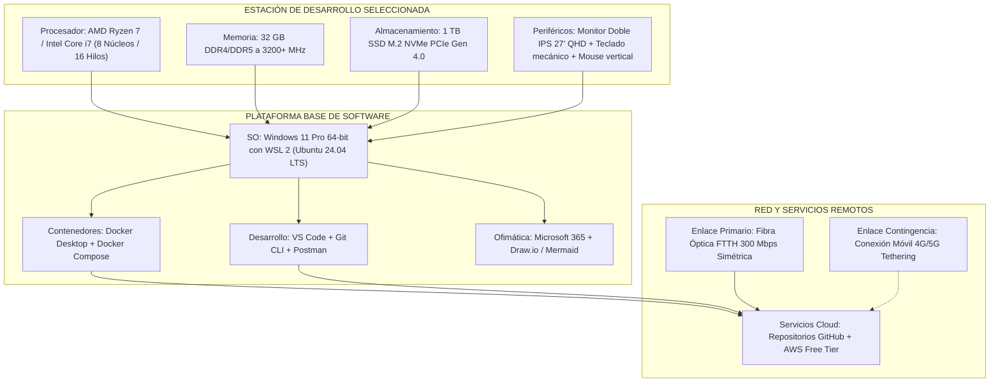

# 3.2 Actividad de Contextualización e Identificación de Conocimientos (Guía y Cuadro Comparativo Resuelto)

> **Programa:** Análisis y Desarrollo de Software (ADSO) - Ficha 228118  
> **Proyecto Formativo:** Desarrollo de software orientado a servicios V2  
> **Fase:** Análisis | **Actividad de Proyecto:** Determinar las especificaciones funcionales del software  
> **Competencia:** 220501046 - TIC (Utilizar herramientas informáticas de acuerdo con las necesidades de manejo de información)  
> **Resultado de Aprendizaje (RAP):** Alistar herramientas de Tecnologías de la Información y la Comunicación (TIC), de acuerdo con las necesidades de procesamiento de información y comunicación (Código: **593154-01**)  
> **Duración estimada:** 8 horas | **Formato Institucional:** GFPI-F-135 V04  

---

# PARTE I: LINEAMIENTOS INSTITUCIONALES DE LA GUÍA

### Descripción de la Actividad
El instructor orienta una sesión magistral sobre:
* La historia de la computación y la arquitectura del computador (hardware y software, CPU, memoria principal, placa base y buses).
* La tipología de computadores y dispositivos móviles.
* La clasificación de periféricos de entrada, salida y mixtos.
* Las tecnologías de almacenamiento (HDD, SSD SATA, M.2, NVMe y las generaciones de bus PCI Express).
* Los tipos de software (de sistema, de aplicación, de programación y utilitario).
* Los pilares de un sistema operativo (gestión de procesos, de memoria, del sistema de archivos, de entrada/salida, y seguridad y control de acceso).
* Los fundamentos de Internet, la evolución del ancho de banda y los medios de conectividad (fibra óptica, Wi-Fi, redes celulares y satelital).

### Actividad de Aprendizaje
> **Alistar herramientas de Tecnologías de la Información y la Comunicación (TIC)**, reconociendo la arquitectura del computador, los periféricos, las tecnologías de almacenamiento, el software, los sistemas operativos y los servicios de Internet disponibles para el proyecto formativo.

### Entorno, Materiales e Instrumentos
* **Ambiente requerido:** Ambiente de formación con equipos de cómputo, periféricos de entrada, salida y mixtos disponibles para manipulación directa, conectividad a internet, tablero y video beam.
* **Estrategias o técnicas didácticas activas:** Exposición magistral, clasificación práctica de periféricos mediante análisis visual de estaciones de trabajo, dinámicas de aula y evaluación gamificada en vivo.
* **Materiales de formación:** Computador, periféricos, tablero, marcadores, video beam, acceso a internet, aplicación de cuestionarios gamificados, material de apoyo suministrado por el instructor.
* **Evidencias de aprendizaje:** Cuadro comparativo de equipos TIC, periféricos, tecnologías de almacenamiento, sistemas operativos y servicios de Internet, alistados para el proyecto formativo.
* **Instrumentos de evaluación:** Lista de chequeo para verificar la correcta identificación y clasificación de los equipos, periféricos y servicios TIC alistados.

---

# PARTE II: DESARROLLO Y RESOLUCIÓN COMPLETA DE LA EVIDENCIA

## 1. Contexto de Alistamiento para el Proyecto Formativo

El proyecto formativo **"Desarrollo de software orientado a servicios V2"** requiere una infraestructura robusta para soportar:
* Modelado y diseño de arquitecturas basadas en microservicios, APIs RESTful y GraphQL.
* Ejecución simultánea de múltiples contenedores Docker (bases de datos PostgreSQL, Redis, backend Spring Boot / Node.js, frontend React).
* Ambientes de pruebas locales automatizadas y compilación modular continua.
* Sincronización continua de código mediante Git CLI y despliegues en infraestructura en la nube.

A continuación, se presentan los cuadros comparativos técnicos y la selección justificada para el equipo de desarrollo.

---

## 2. Cuadros Comparativos Técnicos

### 2.1 Equipos de Cómputo (Estaciones de Trabajo)

| Criterio Técnico | Estación de Escritorio (Desktop Workstation) | Portátil para Desarrollo (Developer Laptop) | Servidor Local Físico (On-Premise Server) | Instancia en la Nube (Cloud VM - AWS/GCP/Azure) |
| :--- | :--- | :--- | :--- | :--- |
| **Capacidad de Procesamiento** | **Muy Alta:** Procesadores multicore (Intel Core i7/i9 o AMD Ryzen 7/9) con TDP elevado (65W-125W), sin limitaciones severas de disipación térmica. | **Media - Alta:** Procesadores móviles de alto rendimiento (series H/HS/HX). Sujeta a limitación térmica (*thermal throttling*) bajo cargas sostenidas. | **Muy Alta / Servidor:** Procesadores Intel Xeon o AMD EPYC diseñados para alta concurrencia, multihilo masivo y operación continua 24/7. | **Totalmente Elástica:** Desde 1 vCPU hasta cientos de núcleos según demanda; escalabilidad vertical y horizontal en minutos. |
| **Memoria RAM y Expansión** | **Alta:** 32 GB a 128 GB DDR4/DDR5; 4 ranuras DIMM; fácil actualización a bajo costo. | **Limitada:** 16 GB a 32 GB DDR4/DDR5; comúnmente soldada en placa o con solo 1-2 ranuras SO-DIMM. | **Masiva:** 64 GB a 512+ GB con memoria registrada ECC (*Error-Correcting Code*) para prevenir corrupción de datos en memoria. | **Bajo Demanda:** Configurable dinámicamente desde 2 GB hasta varios terabytes de RAM por instancia. |
| **Portabilidad y Ergonomía** | **Nula:** Equipo fijo de escritorio. Requiere mobiliario adecuado y periféricos externos independientes. | **Excelente:** Facilidad de traslado entre ambientes de formación SENA, coworking y trabajo remoto. | **Nula:** Montaje en rack o chasis tipo torre en centro de datos / sala de servidores climatizada. | **Totalmente Ubicuo:** Accesible desde cualquier dispositivo con conexión a Internet mediante SSH o interfaces web. |
| **Consumo y Eficiencia** | Consumo medio-alto (200W - 650W con GPU dedicada y múltiples discos). | Muy eficiente energéticamente (45W - 140W); incluye batería de respaldo integrada. | Alto consumo energético continuo (350W - 1000W+); requiere sistemas UPS y climatización dedicada. | Consumo cero local. El costo se absorbe en el modelo operativo de pago por uso (*OpEx*). |
| **Costo Relativo** | **Medio:** Excelente relación costo / rendimiento por componente individual. | **Medio-Alto:** Sobrecosto por miniaturización, chasis, panel integrado y batería. | **Muy Alto (CapEx inicial):** Inversión inicial elevada en chasis, licencias y mantenimiento. | **Variable (OpEx):** Sin inversión inicial; costo recurrente mensual dependiente del tiempo de encendido y tráfico. |
| **Veredicto para ADSO** | **Excelente para estación fija:** Ideal para desarrollo local con múltiples contenedores y compilaciones rápidas. | **Recomendado para Aprendiz:** Ofrece la movilidad requerida para asistir al centro de formación y continuar en casa. | **Innecesario en Fase Análisis:** Sobredimensionado para etapas tempranas de requerimientos. | **Imprescindible para despliegues:** Ideal para publicar APIs intermedias de prueba y bases de datos compartidas. |

---

### 2.2 Periféricos (Entrada, Salida y Mixtos)

| Tipo | Dispositivo y Especificación Técnica | Interfaz / Conexión | Ventajas Operativas | Desventajas / Limitaciones | Impacto en el Proyecto ADSO |
| :--- | :--- | :--- | :--- | :--- | :--- |
| **Entrada** | **Teclado Mecánico Ergonómico** (Switches táctiles silenciosos, formato ANSI 75% o completo, reposamuñecas). | USB-C alámbrico / Bluetooth 5.0 (2.4 GHz RF). | Reduce drásticamente la fatiga muscular y el riesgo de síndrome del túnel carpiano en jornadas extensas de digitación y programación. | Mayor costo frente a teclados de membrana estándar; nivel de ruido acústico según el switch. | **Alto:** Optimiza la velocidad de escritura de código, documentación y precisión sintáctica. |
| **Entrada** | **Mouse Óptico de Precisión Ergonómico Vertical** (Sensor 4000+ DPI, botones programables). | Inalámbrico 2.4 GHz / Bluetooth / USB. | Postura neutral del antebrazo; asignación de macros rápidas para depuración e inspección de código. | Curva de adaptación inicial para usuarios acostumbrados al mouse plano tradicional. | **Medio-Alto:** Prevención ergonómica en largas jornadas de diagramación UML y diseño de interfaces. |
| **Entrada** | **Cámara Web Full HD (1080p a 60 fps)** con micrófono dual con cancelación de ruido. | USB 3.0 Type-A / Type-C. | Calidad óptima en reuniones virtuales, sustentación remota de avances con clientes e instructores. | Mayor consumo de ancho de banda en streaming; sensible a iluminación ambiental deficiente. | **Medio:** Facilita la comunicación profesional y la sustentación sincrónica de evidencias. |
| **Salida** | **Monitor Doble IPS 27” Quad HD (2560x1440)** a 75Hz / 144Hz con soporte VESA ajustable. | DisplayPort 1.4 / HDMI 2.0 / USB-C DisplayPort Alt Mode. | Duplica el espacio de trabajo: permite visualizar el IDE en una pantalla y documentación/terminal/navegador en la otra. | Requiere mayor espacio físico en escritorio y tarjeta gráfica con múltiples salidas de video activas. | **Crítico:** Incrementa la productividad de los desarrolladores entre un 30% y 50% al evitar el cambio constante de ventanas. |
| **Salida** | **Auriculares con Cancelación Activa de Ruido (ANC)** y micrófono de condensador. | Conector 3.5 mm / USB-C / Bluetooth 5.2 (códecs AAC/LDAC). | Aislamiento acústico en ambientes de trabajo colaborativos ruidosos; concentración en resolución de algoritmos complejos. | Posible incomodidad por uso prolongado si la diadema ejerce excesiva presión; autonomía de batería. | **Medio:** Mejora el enfoque mental y la claridad en sesiones de sustentación oral técnica. |
| **Mixto** | **Unidad Externa SSD Portátil de Alta Velocidad (1 TB)** basada en memoria NVMe. | USB 3.2 Gen 2x2 Type-C (hasta 2000 MB/s). | Copias de seguridad instantáneas, transferencia segura de entornos Docker de gran tamaño y aislamiento de proyectos. | Vulnerabilidad ante pérdida física o robo si no cuenta con cifrado por hardware (BitLocker / LUKS). | **Alto:** Aseguramiento local de repositorios, bases de datos y portabilidad de entornos de desarrollo. |
| **Mixto** | **Adaptador / Tarjeta de Red Gigabit Ethernet (10/100/1000/2500 Mbps)**. | RJ-45 nativo / Bus PCIe / Thunderbolt a Ethernet. | Conexión cableada ultraestable, latencia mínima (< 1 ms a router local), tasa constante sin pérdida de paquetes ni interferencia RF. | Pérdida de movilidad al depender de cable físico de red UTP/STP Cat 6 o Cat 6A. | **Crítico:** Garantiza transferencias masivas de datos y sesiones SSH ininterrumpidas a servidores de pruebas. |

---

### 2.3 Tecnologías de Almacenamiento Masivo

| Característica / Parámetro | Disco Duro Mecánico (HDD SATA III) | Unidad Estado Sólido (SSD SATA III 2.5") | SSD M.2 NVMe (PCIe Gen 3.0 x4) | SSD M.2 NVMe (PCIe Gen 4.0 x4) | SSD M.2 NVMe (PCIe Gen 5.0 x4) |
| :--- | :--- | :--- | :--- | :--- | :--- |
| **Principio Físico** | Platos magnéticos giratorios (5400/7200 RPM) y cabezal mecánico lector/escritor. | Memoria Flash NAND electrónica (sin piezas móviles) conectada por interfaz SATA. | Memoria Flash NAND 3D; protocolo NVMe conectado directamente a pistas PCIe del CPU. | Memoria Flash NAND 3D/TLC; duplicación de frecuencia de bus PCIe frente a Gen 3. | Última generación; duplicación de ancho de banda por línea PCIe frente a Gen 4. |
| **Tasa Lectura Secuencial** | 80 – 160 MB/s | 500 – 550 MB/s (límite del bus SATA III a 6 Gbps). | 2.500 – 3.500 MB/s | 5.000 – 7.400 MB/s | 10.000 – 14.000 MB/s |
| **Tasa Escritura Secuencial** | 80 – 150 MB/s | 450 – 520 MB/s | 1.800 – 3.000 MB/s | 4.000 – 6.800 MB/s | 9.000 – 12.000 MB/s |
| **Operaciones I/O Aleatorias (IOPS 4K)** | 75 – 150 IOPS | 50.000 – 90.000 IOPS | 250.000 – 450.000 IOPS | 600.000 – 1.000.000 IOPS | 1.200.000 – 1.500.000 IOPS |
| **Latencia de Acceso Típica** | 10 – 15 milisegundos (ms) | 50 – 100 microsegundos (µs) | 20 – 30 microsegundos (µs) | 10 – 15 microsegundos (µs) | < 10 microsegundos (µs) |
| **Resistencia a Impactos** | **Muy Baja:** Choques físicos provocan colisión del cabezal (*head crash*) y pérdida de datos. | **Alta:** Inmune a golpes y vibraciones normales de operación. | **Alta:** Excelente resistencia mecánica al estar atornillado directo a la placa base. | **Alta:** Excelente resistencia mecánica. | **Alta:** Excelente resistencia mecánica. |
| **Comportamiento Térmico** | 30°C – 45°C. No requiere disipadores pasivos dedicados. | 30°C – 50°C. Chasis metálico de 2.5" disipa el calor fácilmente. | 40°C – 65°C. Opera bien con disipadores pasivos sencillos. | 50°C – 75°C. **Requiere disipador metálico** para evitar estrangulamiento térmico (*thermal throttling*). | 65°C – 85°C+. **Requiere disipadores robustos**, en ocasiones con ventilación activa. |
| **Costo por Gigabyte** | **Muy Económico:** El menor costo por Terabyte del mercado. | **Económico:** Excelente opción para revitalizar equipos antiguos. | **Moderado:** Muy accesible en capacidades de 500 GB a 2 TB. | **Equilibrado:** Estándar actual de la industria en precio / rendimiento. | **Muy Elevado:** Tecnología puntera con sobreprecio para entusiastas/servidores élite. |
| **Veredicto Técnico ADSO** | Útil únicamente para copias de seguridad frías o almacenamiento pasivo masivo. | Aceptable para almacenamiento secundario de proyectos. | **Excelente opción base:** Desempeño sobresaliente para IDEs y Docker a precio accesible. | **Recomendado Oficialmente:** Mejor balance actual entre velocidad extrema de compilación, arranque de SO y costo. | Innecesario para el alcance actual del proyecto formativo; costo injustificado. |

---

### 2.4 Sistemas Operativos

| Criterio de Selección | Microsoft Windows 11 Pro (64-bit) | GNU/Linux (Ubuntu 24.04 LTS / Debian 12) | Apple macOS (Sonoma / Sequoia) |
| :--- | :--- | :--- | :--- |
| **Arquitectura de Kernel** | Kernel Híbrido Windows NT (versión 10.0+). | Kernel Monolítico Modular Linux (versión 6.x). | Kernel Híbrido XNU (basado en Mach 3.0 y subsistema BSD Unix). |
| **Sistema de Archivos Nativo** | NTFS (con soporte ReFS en versiones Server/Workstation). | ext4 (predeterminado), btrfs, ZFS, XFS. | APFS (*Apple File System*), HFS+ legado. |
| **Gestión de Memoria y Procesos** | Excelente asignación dinámica; consumo base de RAM relativamente elevado (3.5 GB - 5 GB en reposo). | Gestión altamente eficiente y ligera (800 MB - 1.8 GB en reposo con entorno GNOME/XFCE); *Out-Of-Memory killer* configurable. | Optimización extrema de memoria unificada en chips Apple Silicon (M1/M2/M3); compresión dinámica de RAM. |
| **Compatibilidad con Contenedores y Microservicios** | Excelente a través de **WSL 2** (*Windows Subsystem for Linux*) que ejecuta un kernel Linux real sobre Hyper-V. | **Nativa al 100%:** Docker, Podman y Kubernetes se ejecutan directamente sobre los *namespaces* y *cgroups* del kernel sin capa de virtualización intermedia. | Basada en máquina virtual ligera Linux (Docker Desktop / Colima). Rápida pero con sobrecarga de memoria frente a Linux nativo. |
| **Seguridad y Control de Acceso** | Windows Defender integrado, TPM 2.0 obligatorio, BitLocker, control de cuentas UAC, directivas de grupo locales (GPO). | Modelo estricto de permisos Unix (rwx), SELinux / AppArmor, autenticación PAM, cortafuegos integrado (UFW / iptables), cifrado LUKS. | Arquitectura basada en Unix POSIX, SIP (*System Integrity Protection*), cifrado FileVault 2, aislamiento por *Sandboxing*. |
| **Ecosistema de Desarrollo Ofimático y Software** | Compatibilidad nativa con Microsoft 365 (Word, Excel, PowerPoint), Teams, Visual Studio 2022, VS Code, JetBrains y emuladores móviles. | Suites de código abierto (LibreOffice, OnlyOffice), clientes web de Microsoft 365 / Google Workspace. Dominio absoluto de utilidades CLI de servidor. | Suite iWork nativa (Pages, Numbers, Keynote), Microsoft 365, VS Code, JetBrains y exclusivo para compilación de iOS en **Xcode**. |
| **Licenciamiento y Costo** | Licencia comercial propietaria por equipo (OEM o Retail). | **Gratuito y de Código Abierto (Open Source):** Licencias GPL/Apache; sin costo por puesto. | Propietario; incluido con la adquisición obligatoria de hardware Apple. |
| **Veredicto Técnico ADSO** | **Muy Recomendado:** Permite desarrollo híbrido gracias a WSL 2 y asegura total compatibilidad con herramientas ofimáticas corporativas. | **Altamente Recomendado:** Es el entorno idéntico a los servidores de producción en la nube; máxima eficiencia en recursos. | Recomendado si el aprendiz ya posee el hardware o requiere compilar aplicaciones nativas para ecosistema Apple. |

---

### 2.5 Tecnologías de Conectividad e Internet

| Tecnología | Medio Físico / Frecuencias | Ancho de Banda (Bajada / Subida) | Latencia Media (*Ping*) | Estabilidad y Jitter | Cobertura y Factibilidad | Justificación para Desarrollo de Software |
| :--- | :--- | :--- | :--- | :--- | :--- | :--- |
| **Fibra Óptica (FTTH)** | Filamentos de vidrio / pulsos de luz monomodo (GPON / XGS-PON). | **100 – 900+ Mbps (Simétrico)** | **Bajísimo:** 2 – 10 ms hacia nodos nacionales; < 60 ms internacionales. | **Excelente:** Inmune a interferencias electromagnéticas, clima o ruido de RF. | Amplia cobertura en cascos urbanos y ciudades intermedias. | **La opción ideal:** Permite clonar y subir imágenes de Docker de varios gigabytes y repositorios Git sin degradación ni retrasos. |
| **Wi-Fi 6 / 6E (802.11ax)** | Ondas de radio en bandas de 2.4 GHz, 5 GHz y 6 GHz (canales de hasta 160 MHz con OFDMA y MU-MIMO). | **300 – 1200+ Mbps** (enlace local inalámbrico). | 3 – 12 ms hacia el router local. | **Alta**, pero sujeta a obstáculos físicos (muros de concreto), distancia y saturación de canales vecinos. | Cobertura local en ambientes de formación, oficinas y hogares con routers compatibles. | Ideal para estaciones móviles y portátiles en el aula de formación SENA cuando no hay tomas de red disponibles. |
| **Red Móvil 4G LTE / 5G** | Microondas celulares terrestres (Sub-6 GHz y ondas milimétricas mmWave). | **4G:** 20 – 60 Mbps / 5 – 15 Mbps. **5G:** 100 – 600+ Mbps / 30 – 100 Mbps. | **4G:** 35 – 80 ms. **5G:** 12 – 30 ms. | **Variable:** Depende de la distancia a la radiobase (BTS), climatología y cantidad de usuarios concurrentes. | Excelente cobertura geográfica a nivel nacional en centros poblados. | Conexión de contingencia (*failover* o tethering móvil) ante caídas accidentales del servicio de fibra óptica local. |
| **Internet Satelital LEO (Starlink)** | Constelación de satélites en órbita baja (~550 km) en bandas Ku/Ka con antena en fase. | **50 – 220 Mbps bajada** / 10 – 25 Mbps subida (Asimétrico). | **Moderado:** 30 – 55 ms. | **Buena:** Muy superior a los satélites GEO (> 600 ms), pero sensible a tormentas densas y obstrucciones del cielo. | Cobertura global, ideal para zonas rurales o no interconectadas por fibra. | Respaldo fundamental si los aprendices operan desde locaciones rurales apartadas sin infraestructura terrestre. |

---

## 3. Selección y Alistamiento Oficial para el Proyecto Formativo

### Cumplimiento de Criterios de Evaluación
1. **Identifica:** Se identificaron con precisión las clases de equipos, periféricos, interfaces de almacenamiento y tipos de software.
2. **Compara:** Se tabularon características cuantificables de rendimiento, latencia, costos y arquitectura.
3. **Escoge:** Se seleccionó la configuración técnica que garantiza que el desarrollo de microservicios con Docker y bases de datos relacionales se ejecute sin estrangulamiento de recursos en la fase de análisis del software.
