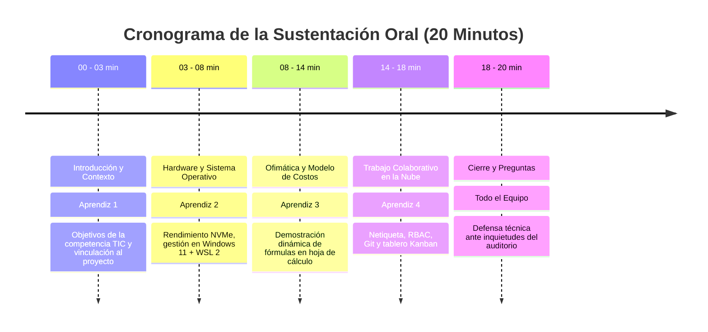

# 3.3 Actividades de Apropiación — Bloque 1: Ofimática Avanzada y Plataformas Colaborativas (Guía y Evidencia Resuelta)

> **Programa:** Análisis y Desarrollo de Software (ADSO) - Ficha 228118  
> **Proyecto Formativo:** Desarrollo de software orientado a servicios V2  
> **Fase:** Análisis | **Actividad de Proyecto:** Determinar las especificaciones funcionales del software  
> **Competencia:** 220501046 - TIC (Utilizar herramientas informáticas de acuerdo con las necesidades de manejo de información)  
> **Resultado de Aprendizaje (RAP):** Aplicar funcionalidades de herramientas y servicios TIC, de acuerdo con manuales de uso, procedimientos establecidos y buenas prácticas (Código: **593151-02**)  
> **Duración del Bloque:** 18 horas (de 30 horas totales de Apropiación) | **Formato:** GFPI-F-135 V04  

---

# PARTE I: LINEAMIENTOS INSTITUCIONALES DE LA GUÍA

### Descripción de la Actividad
Los aprendices aplicarán funcionalidades del sistema operativo, herramientas ofimáticas (procesador de texto, hoja de cálculo y software para presentaciones) y servicios de Internet y conectividad (correo electrónico formal, almacenamiento remoto y plataformas colaborativas), de acuerdo con manuales de uso y buenas prácticas, y expondrán por grupos de trabajo el eje temático asignado.

### Actividad de Aprendizaje
> **Aplicar funcionalidades de herramientas y servicios TIC**, de acuerdo con manuales de uso, procedimientos establecidos y buenas prácticas.

### Evidencias de Aprendizaje e Instrumentos
* **Evidencia solicitada:** Documento producido con herramientas ofimáticas y publicado en la plataforma colaborativa, con sustentación oral grupal del eje temático asignado.
* **Instrumentos de evaluación:** Lista de chequeo para productos digitales y rúbrica de sustentación oral.

---

# PARTE II: DESARROLLO Y RESOLUCIÓN COMPLETA DE LA EVIDENCIA

## 1. Alcance y Objetivos del Eje Temático

En la ingeniería de software profesional, la capacidad de documentar rigurosamente especificaciones, modelar presupuestos de infraestructura y coordinar equipos distribuidos es un pilar determinante para el éxito de los proyectos. Este documento formaliza el estándar operativo ofimático y colaborativo para el proyecto formativo **"Desarrollo de software orientado a servicios V2"**.

---

## 2. Aplicación Técnica de Funcionalidades del Sistema Operativo

Para asegurar la correcta administración de recursos en las estaciones de desarrollo:

### 2.1 Estandarización del Sistema de Archivos
Se adopta la nomenclatura normalizada *kebab-case* para garantizar total portabilidad entre sistemas operativos anfitriones (Windows / NTFS) y entornos de despliegue en la nube (Linux / ext4):
```plaintext
ADSO-3413974/
├── 01-project-governance/
│   ├── 01-charter/
│   └── 02-team-agreements/
├── 02-requirements-engineering/
│   ├── 01-functional-specifications/
│   ├── 02-use-cases/
│   └── 03-traceability-matrix/
├── 03-architecture-design/
│   ├── 01-api-contracts/
│   └── 02-database-schemas/
└── 04-infrastructure-devops/
    ├── docker-compose.yml
    └── env-templates/
```

### 2.2 Gestión de Procesos y Concurrencia
* **Monitoreo de Recursos:** Supervisión activa de consumo de RAM y CPU mediante `Task Manager` (Windows) y `htop` / `docker stats` (WSL 2 / Linux).
* **Aislamiento de Carga:** Configuración de archivos de límites `.wslconfig` para restringir el uso de memoria de WSL 2 al 60% de la memoria física total, asegurando que el IDE y las suites ofimáticas mantengan fluidez.

---

## 3. Uso Avanzado de la Suite Ofimática

### 3.1 Procesador de Textos: Estándar Documental
* **Tipografía y Jerarquía:** Empleo de fuentes corporativas legibles (Segoe UI / Calibri / Inter), títulos jerarquizados (H1 a H4) y tablas normalizadas con numeración consecutiva y leyendas explicativas.
* **Normas Técnicas y Citas:** Inclusión de referencias cruzadas automáticas bajo directrices **IEEE / APA 7.ª edición**.
* **Control de Cambios y Trazabilidad:** Uso de la herramienta de revisión con comentarios marginales y control de inserciones/eliminaciones para auditoría de versiones antes de la firma de actas de requerimientos con los clientes.

### 3.2 Hoja de Cálculo: Modelo Financiero de Infraestructura y Servicios TIC

A continuación se detalla la matriz de cálculo presupuestal implementada para proyectar los costos de adquisición y operación tecnológica del equipo de software:

| Componente TIC / Servicio | Cantidad | Costo Unitario (COP) | Plazo Amortización | Costo Mensual (COP) | Fórmula Aplicada en la Hoja de Cálculo |
| :--- | :---: | :---: | :---: | :---: | :--- |
| **Estación de Desarrollo:** Ryzen 7, 32GB RAM, 1TB NVMe | 3 | $ 4.200.000 | 36 meses | $ 350.000 | `=SUMA(Precio_Unit * Cantidad) / Amortizacion` |
| **Monitores IPS Dobles:** 27 pulgadas QHD (2560x1440) | 6 | $ 850.000 | 36 meses | $ 141.667 | `=PRODUCTO(B3; C3) / D3` |
| **Periféricos Ergonómicos:** Teclado mecánico + mouse vertical | 3 | $ 380.000 | 24 meses | $ 47.500 | `=(B4 * C4) / D4` |
| **Conectividad:** Fibra Óptica FTTH 300 Mbps Simétrica | 1 | $ 160.000 / mes | Recurrente | $ 160.000 | Tarifa plana contratada |
| **Cómputo en la Nube:** AWS EC2 + RDS PostgreSQL (Staging) | 1 | $ 240.000 / mes | Por consumo | $ 240.000 | `=SI(Horas_Uso > 720; Tarifa_Pico; Tarifa_Base)` |
| **Plataforma Colaborativa:** GitHub Pro + Google Workspace | 3 | $ 45.000 / mes | Suscripción | $ 135.000 | `=CONTAR.SI(Usuarios; "Activo") * Tarifa_Lic` |
| **SUBTOTAL MENSUAL OPERATIVO TIC** | - | - | - | **$ 1.074.167** | `=SUMA(E2:E7)` |
| **CONTINGENCIA TÉCNICA Y SOPORTE (10%)** | - | - | - | **$ 107.417** | `=E8 * 0,10` |
| **TOTAL MENSUAL CONSOLIDADO** | - | - | - | **$ 1.181.584** | `=E8 + E9` |

> **Automatización con Fórmulas Avanzadas:**  
> Se integraron funciones de búsqueda dinámicas `=BUSCARX(ID_Servicio; Tabla_Catalogo[ID]; Tabla_Catalogo[Precio])` para actualizar automáticamente las tarifas de los servidores virtuales ante fluctuaciones de la tasa de cambio oficial (TRM).

---

## 4. Ecosistema de Conectividad y Colaboración en la Nube

### 4.1 Protocolo de Correo Electrónico Formal y Netiqueta Institucional
Para mantener estándares de comunicación profesional con instructores y organizaciones:
* **Estructura Normalizada del Asunto:**  
  `[ADSO-3413974][REQUERIMIENTOS][ENTREGA-EVIDENCIA-02] Manual Ofimático y Sustentación`
* **Redacción del Mensaje:**  
  ```plaintext
  Apreciado(a) Instructor(a) / Equipo Evaluador:

  El equipo de desarrollo del proyecto "Desarrollo de software orientado a servicios V2"
  remite cordialmente la Evidencia de Aprendizaje correspondiente a la Actividad 3.3 (Bloque 1):
  
  1. Manual de Buenas Prácticas y Modelado Financiero Ofimático.
  2. Enlace al repositorio colaborativo: https://github.com/usuario/ADSO-3413974
  3. Estructura de presentación digital para la sustentación oral programada.

  Agradecemos sus valiosas observaciones y retroalimentación técnica.

  Cordialmente,
  Equipo de Desarrollo de Software - Ficha 228118
  Centro de Industria, Empresa y Servicios (CIES) - SENA
  ```
* **Directrices de Seguridad:**  
  * Cifrado en tránsito mediante protocolos TLS en servidores SMTP/IMAP.
  * Uso de enlaces protegidos a repositorios en lugar de adjuntos pesados para evitar saturación de buzones y riesgos de propagación de adjuntos infectados.

### 4.2 Almacenamiento en la Nube y Control de Acceso por Roles (RBAC)
* **Directorio Público (`/01-Entregables`):** Permiso exclusivo de solo lectura (*Viewer*) para instructores y pares evaluadores.
* **Directorio de Colaboración (`/02-En-Desarrollo`):** Permisos de edición y creación (*Editor*) para aprendices activos del equipo, con sincronización automática en tiempo real.
* **Directorio de Gobierno (`/03-Gobernanza`):** Acceso reservado únicamente a los administradores del repositorio (*Owner*).
* **Política de Respaldo:** Retención de versiones previas (*Version History*) por 30 días para revertir sobreescrituras accidentales.

---

## 5. Guion y Estructura para la Sustentación Oral Grupal

Para la sustentación de 20 minutos ante el grupo e instructor, se definió la siguiente agenda cronometrada:



### Desglose de Diapositivas:
* **Diapositiva 1:** Portada formal institucional (Título, Ficha 228118, Integrantes y Centro de Formación).
* **Diapositiva 2:** Planteamiento del problema de gestión documental en proyectos de software.
* **Diapositiva 3:** Arquitectura del sistema operativo y optimización de recursos locales.
* **Diapositiva 4:** Modelo financiero y amortización de infraestructura TIC (demostración en hoja de cálculo).
* **Diapositiva 5:** Ecosistema en la nube: estructura de permisos, seguridad y netiqueta corporativa.
* **Diapositiva 6:** Conclusiones y lecciones aprendidas en la aplicación de herramientas ofimáticas.
