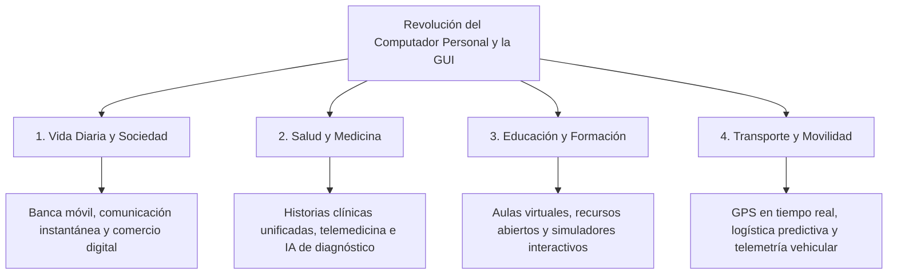

# 3.3 Actividades de Apropiación — Bloque 2: Cine-Foro y Ensayo Reflexivo (Guía y Ensayo Resuelto)

> **Programa:** Análisis y Desarrollo de Software (ADSO) - Ficha 228118  
> **Proyecto Formativo:** Desarrollo de software orientado a servicios V2  
> **Fase:** Análisis | **Actividad de Proyecto:** Determinar las especificaciones funcionales del software  
> **Competencia:** 220501046 - TIC (Utilizar herramientas informáticas de acuerdo con las necesidades de manejo de información)  
> **Resultado de Aprendizaje (RAP):** Evaluar los resultados, de acuerdo con los requerimientos (Código: **593153-03**)  
> **Duración del Bloque:** 12 horas (de 30 horas totales de Apropiación) | **Formato:** GFPI-F-135 V04  

---

# PARTE I: LINEAMIENTOS INSTITUCIONALES DE LA GUÍA

### Descripción de la Actividad
Los aprendices analizarán, mediante **cine-foro**, un caso de innovación tecnológica (el desarrollo del computador personal y la interfaz gráfica de usuario) y el impacto contemporáneo de las TIC en la vida diaria, la salud, la educación y el transporte, evaluando en un ensayo reflexivo si los resultados obtenidos responden a los requerimientos que les dieron origen.

### Actividad de Aprendizaje
> **Evaluar los resultados**, de acuerdo con los requerimientos.

### Evidencias de Aprendizaje e Instrumentos
* **Evidencia solicitada:** Ensayo reflexivo de cine-foro con la evaluación de los resultados obtenidos frente a los requerimientos del caso analizado.
* **Instrumento de evaluación:** Lista de chequeo para verificar la calidad argumentativa, coherencia conceptual y cumplimiento de criterios técnicos.

---

# PARTE II: DESARROLLO Y RESOLUCIÓN COMPLETA DEL ENSAYO REFLEXIVO

# De la Fricción de la Consola a la Ubicuidad Digital: Una Evaluación Crítica del Computador Personal, la Interfaz Gráfica y su Impacto Social Contemporáneo

**Modalidad:** Ensayo Reflexivo Crítico  
**Programa:** Análisis y Desarrollo de Software (ADSO)  

---

## 1. Introducción y Marco Histórico del Caso

A mediados del siglo XX, la computación representaba una tecnología remota, inaccesible y centralizada. Enormes mainframes gubernamentales y militares operaban bajo un paradigma de aislamiento en el que operadores especializados alimentaban tarjetas perforadas y cintas magnéticas mediante comandos textuales crípticos. Existía una brecha cognitiva casi infranqueable entre la potencia de cómputo de la máquina y las capacidades del ciudadano común.

El caso de estudio abordado en el cine-foro documenta el momento en que un colectivo de ingenieros y visionarios —iniciado en los laboratorios de **Xerox PARC** y catapultado comercialmente por **Steve Jobs (Apple)** y **Bill Gates (Microsoft)**— formuló una premisa radical: transformar el computador en una herramienta personal, intuitiva y al servicio directo de la creatividad humana.

Este ensayo evalúa si las soluciones desarrolladas durante la revolución del computador personal y la **Interfaz Gráfica de Usuario (GUI)** lograron responder con fidelidad a los requerimientos iniciales, analizando cómo esa transformación tecnológica redefine hoy cuatro dimensiones esenciales de la sociedad: la vida diaria, la medicina, la educación y los sistemas de transporte.

---

## 2. El Requerimiento Inicial y la Ruptura del Paradigma

El requerimiento original que motivó el surgimiento del computador personal no fue un incremento desmedido en la potencia de procesamiento matemático, sino la **eliminación de la fricción cognitiva en la interacción humano-computador (HCI)**.

### Las Innovaciones Seminales de Xerox PARC, Apple y Microsoft
1. **La Metáfora del Escritorio (*Desktop Metaphor*):** Reemplazar la línea de comandos abstracta por un espacio visual interactivo con carpetas, documentos, ventanas superpuestas y una papelera de reciclaje.
2. **El Ratón (*Mouse*) y la Manipulación Directa:** Permitir al usuario apuntar, seleccionar y arrastrar objetos digitales en la pantalla en lugar de memorizar complejas secuencias sintácticas.
3. **El Principio WYSIWYG (*What You See Is What You Get*):** Asegurar que la representación digital en pantalla coincidiera con absoluta fidelidad con el resultado final impreso o exportado.

El lanzamiento del **Apple Macintosh en 1984** y la posterior masificación global de **Microsoft Windows** confirmaron que la interfaz gráfica no era un simple adorno estético, sino la condición indispensable para que el computador se convirtiera en la mayor herramienta cognitiva de la humanidad.

---

## 3. Evaluación del Impacto Contemporáneo en Cuatro Dimensiones

### 3.1 Vida Diaria y Dinámicas Sociales
* **Requerimiento inicial:** Automatizar tareas rutinarias de oficina, cálculo contable y archivo doméstico de documentos.
* **Resultado contemporáneo:** El computador personal evolucionó hacia el teléfono inteligente (*smartphone*), permeando cada esfera de la cotidianidad. La banca móvil, las compras en línea, los trámites públicos y la interacción afectiva ocurren a través de interfaces visuales táctiles.
* **Desviaciones observadas:** La sobreexposición tecnológica ha traído consigo fenómenos no previstos: fragmentación de la atención, problemas de aislamiento social y nuevas brechas de ciberseguridad donde los ciudadanos son víctimas de ingeniería social y suplantación de identidad.

### 3.2 Salud y Telemedicina
* **Requerimiento inicial:** Registrar y tabular censos y facturaciones hospitalarias.
* **Resultado contemporáneo:** La computación interactiva ha transformado la supervivencia médica. Los sistemas de Información Hospitalaria (HIS) permiten compartir historiales clínicos en tiempo real; los algoritmos de visión artificial asisten en la detección temprana de patologías en resonancias magnéticas, y la telemedicina acerca especialistas de alto nivel a pacientes en comunidades rurales apartadas.
* **Desviaciones observadas:** Riesgos críticos de vulneración de datos biométricos y la necesidad de regular éticamente el uso de modelos de inteligencia artificial en decisiones de triaje clínico.

### 3.3 Educación y Democratización del Conocimiento
* **Requerimiento inicial:** Disponer de una máquina para aprender conceptos matemáticos y escribir textos escolares.
* **Resultado contemporáneo:** Caída de las fronteras físicas de la enseñanza. Entornos virtuales como la plataforma del SENA, plataformas abiertas como GitHub y repositorios científicos globales permiten que cualquier individuo con conexión a la red acceda a formación técnica de primer nivel. Las interfaces interactivas han dado paso a simuladores quirúrgicos, mecánicos y de desarrollo de software en tres dimensiones.
* **Desviaciones observadas:** La disparidad en el acceso a infraestructura de hardware de calidad profundiza la brecha social entre quienes disponen de conectividad avanzada y quienes carecen de ella.

### 3.4 Transporte, Logística y Movilidad Inteligente
* **Requerimiento inicial:** Computar trayectorias balísticas y controlar la logística militar de suministros.
* **Resultado contemporáneo:** Integración fluida entre posicionamiento satelital (GPS), sensores IoT y redes móviles. Los sistemas de navegación calculan rutas óptimas en tiempo real disminuyendo congestiones y emisiones de gases de efecto invernadero; el transporte masivo opera bajo telemetría precisa y la industria automotriz avanza con paso firme hacia la conducción autónoma.
* **Desviaciones observadas:** Dependencia extrema de la señal satelital y vulnerabilidad de las redes de semaforización ante eventuales ciberataques.

---

## 4. Matriz de Comprobación: Requerimientos vs. Resultados Obtenidos

En cumplimiento formal del criterio del SENA (*"Comprueba el funcionamiento de los equipos, productos o servicios obtenidos con el uso de herramientas TIC, de acuerdo con los resultados esperados"*):

| Dimensión Analizada | Requerimiento Original Formulado | Producto / Servicio TIC Alcanzado | ¿Cumplió el Resultado Esperado? | Desviación Crítica o Efecto Colateral |
| :--- | :--- | :--- | :---: | :--- |
| **Accesibilidad Humano-Computador** | Lograr que personas comunes operen computadores sin programar código. | Entornos de escritorio visuales (WIMP), navegación web táctil y asistentes de voz. | **SÍ (Superado)** | Dependencia de interfaces que distancian al usuario común de comprender la estructura lógica interna de los sistemas. |
| **Integridad y Almacenamiento de Datos** | Eliminar la pérdida de datos provocada por daños físicos en papel o cintas. | Sistemas de archivos transaccionales (NTFS, ext4), redundancia RAID y almacenamiento en la nube. | **SÍ** | Nuevas amenazas de ataques distribuidos (ransomware) y vulnerabilidad de bases de datos centralizadas. |
| **Conectividad Interpersonal** | Enlazar equipos dentro de una misma red local corporativa. | Red global de Internet, plataformas colaborativas sincrónicas y computación distribuida. | **SÍ (Superado)** | Saturación informativa, dificultad para desconectarse y pérdida de límites laborales. |
| **Resolución de Retos Comunitarios** | Agilizar tareas administrativas y operativas de las instituciones. | Soluciones integradas con sensores IoT, análisis de datos en la nube y aplicaciones de teleasistencia. | **SÍ** | Obsolescencia programada de dispositivos y generación masiva de residuos electrónicos (*e-waste*). |

---

## 5. Conclusión y Reflexión Ética para el Desarrollador ADSO

El cine-foro sobre la historia de la computación deja una directriz fundamental para los aprendices del tecnólogo en **Análisis y Desarrollo de Software**:

> *Las soluciones tecnológicas más trascendentales de la historia no triunfaron por su complejidad técnica oculta, sino por su capacidad de responder con empatía, sencillez y rigor a las necesidades reales de los seres humanos.*

En nuestro proyecto formativo **"Desarrollo de software orientado a servicios V2"**, esta evaluación nos impulsa a diseñar arquitecturas donde la experiencia de usuario (UX/UI), la accesibilidad, la seguridad de la información y la optimización de recursos sean los criterios rectores que guíen cada requerimiento funcional que formulemos y codifiquemos.
