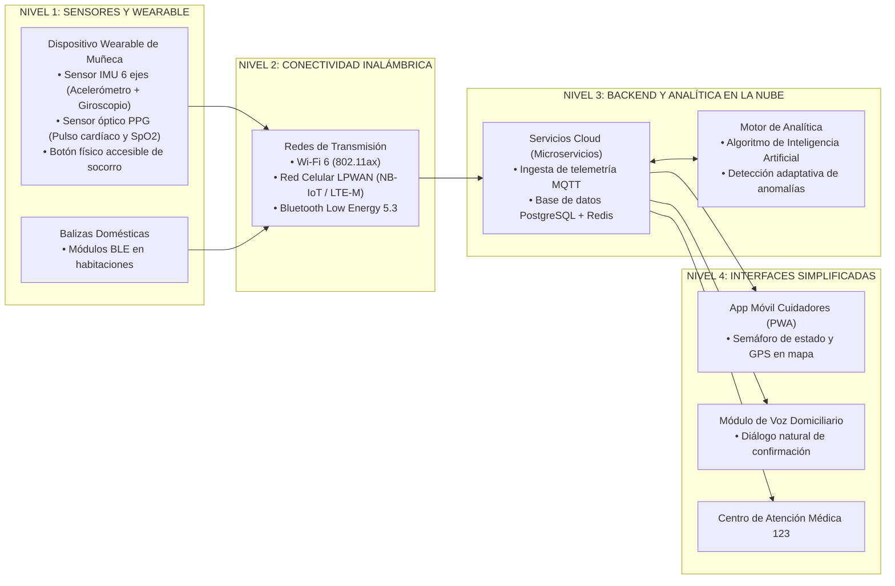

# 3.4 Actividades de Transferencia del Conocimiento (Guía y Propuesta Tecnológica Optimizada)

> **Programa:** Análisis y Desarrollo de Software (ADSO) - Ficha 228118  
> **Proyecto Formativo:** Desarrollo de software orientado a servicios V2  
> **Fase:** Análisis | **Actividad de Proyecto:** Determinar las especificaciones funcionales del software  
> **Competencia:** 220501046 - TIC (Utilizar herramientas informáticas de acuerdo con las necesidades de manejo de información)  
> **Resultado de Aprendizaje (RAP):** Optimizar los resultados, de acuerdo con la verificación (Código: **593152-04**)  
> **Duración estimada:** 8 horas | **Formato Institucional:** GFPI-F-135 V04  

---

# PARTE I: LINEAMIENTOS INSTITUCIONALES DE LA GUÍA

### Descripción de la Actividad
Los aprendices identificarán una problemática real del entorno comunitario (por ejemplo, la atención y comunicación ante emergencias médicas en adultos mayores que viven solos) y formularán una propuesta de solución tecnológica combinando sensores, geolocalización, conectividad inalámbrica e interfaces simplificadas, a partir de la verificación de las herramientas TIC alistadas, aplicadas y evaluadas en las actividades anteriores.

A partir de la retroalimentación recibida en la sustentación, los aprendices optimizarán la propuesta, documentarán los ajustes realizados y defenderán sus decisiones con el vocabulario técnico apropiado (Inteligencia Artificial, sensores, GPS, conectividad inalámbrica, plataformas digitales y aprendizaje adaptativo).

### Actividad de Aprendizaje
> **Optimizar los resultados**, de acuerdo con la verificación.

### Evidencias de Aprendizaje e Instrumentos
* **Evidencia solicitada:** Propuesta de solución tecnológica optimizada tras la verificación, presentada y sustentada ante el grupo.
* **Instrumentos de evaluación:** Lista de chequeo y sustentación técnica para verificar que la propuesta responde a la problemática identificada y a la verificación realizada.

---

# PARTE II: DESARROLLO Y RESOLUCIÓN COMPLETA DE LA PROPUESTA OPTIMIZADA

## 1. Planteamiento de la Problemática Comunitaria

En nuestra comunidad, un número creciente de adultos mayores reside de manera independiente en sus hogares. Esta población enfrenta un riesgo crítico de vulnerabilidad ante eventos de salud agudos:
* **Caídas Accidentales Severas:** Constituyen la causa primaria de traumatismo craneoencefálico, pérdida de movilidad y fracturas óseas complejas en adultos mayores.
* **Síndrome de Inmovilidad Prolongada (*The Long-Lie Syndrome*):** Al sufrir una caída incapacitante, el adulto mayor queda impedido para incorporarse o alcanzar un teléfono convencional o botón de pánico de pared. Permanecer horas tendido en el suelo deriva en hipotermia, deshidratación grave, rabdomiólisis e incluso la muerte.
* **Pérdida de Conciencia y Desorientación Cognitiva:** Eventos cardiovasculares o episodios de desorientación impiden que la persona comunique con claridad su estado de salud o su ubicación física exacta.

### Barreras de las Soluciones Actuales
* **Botones de Pánico Fijos:** Solo sirven si el accidente ocurre a pocos centímetros de la pared donde están anclados.
* **Teléfonos Inteligentes:** Requieren destreza motriz fina, fuentes pequeñas, menús confusos y desbloqueos que resultan imposibles de manipular en medio de una crisis médica aguda.

---

## 2. Arquitectura de la Solución Tecnológica Inicial ("SeniorSafe IoT")

Se diseñó la arquitectura del sistema **SeniorSafe IoT**, una plataforma inteligente de teleasistencia reactiva y preventiva basada en la integración de las tecnologías TIC alistadas en la fase de análisis:

### Componentes de la Arquitectura Base
1. **Instrumentación y Sensores IoT:**
   * Sensor inercial IMU de 6 ejes para medir aceleraciones bruscas y giros corporales.
   * Sensor óptico PPG (*Photoplethysmography*) para registro continuo de frecuencia cardíaca y saturación de oxígeno ($SpO_2$).
2. **Geolocalización:**
   * Módulo multiconstelación GNSS (GPS, GLONASS y Galileo) para localización precisa en exteriores.
   * Balizas Bluetooth Low Energy (BLE) y triangulación de puntos de acceso Wi-Fi para ubicación interna dentro del hogar.
3. **Conectividad Inalámbrica:**
   * Módulo celular LPWAN (*Narrowband-IoT* / LTE-M) con tarjeta eSIM integrada para transmitir telemetría con muy bajo consumo y alta penetración en interiores.
   * Interfaz Wi-Fi 6 (802.11ax) para sincronización pesada en la base de carga.
4. **Interfaces Accesibles:**
   * Botón de pánico táctil de alto contraste y textura rugosa.
   * Aplicación móvil con interfaz visual simplificada bajo paradigma de semáforo (Verde: Estable, Amarillo: Alerta leve, Rojo: Emergencia confirmada).

---

## 3. Proceso de Verificación Técnica y Retroalimentación de la Sustentación

En la sesión de sustentación técnica ante el grupo e instructor, la prueba de concepto inicial fue sometida a rigurosa validación, identificando tres cuellos de botella críticos:

1. **Deficiencia 1 (Falsos Positivos Frecuentes):**  
   El algoritmo inicial empleaba un umbral estático de aceleración (> 3.5 G). Acciones inofensivas como dejarse caer rápidamente en un sillón blando, soltar la pulsera sobre una mesa de madera o aplaudir activaban innecesariamente el protocolo de emergencia médica.
2. **Deficiencia 2 (Agotamiento Rápido de Batería por GPS Continuo):**  
   El receptor GNSS permanecía energizado de manera permanente. Dentro de las viviendas, las losas de hormigón atenuaban la señal de los satélites, forzando al receptor a consumir máxima corriente y agotando la batería en apenas **14 horas**, exigiendo recargas diarias que el adulto mayor olvidaba realizar.
3. **Deficiencia 3 (Ansiedad y Estrés en la Cancelación):**  
   Para anular una falsa alarma, el usuario debía presionar una combinación rápida de botones en menos de 10 segundos, tarea inviable para personas con temblor esencial o artritis.

---

## 4. Optimización Documentada de la Propuesta Tecnológica

Para dar cumplimiento formal al resultado de aprendizaje **"Optimizar los resultados, de acuerdo con la verificación"**, se implementaron mejoras sustanciales:

### 4.1 Incorporación de Inteligencia Artificial en el Borde (*TinyML*) y Aprendizaje Adaptativo
* **Optimización Realizada:** Se sustituyeron los umbrales fijos por una red neuronal convolucional compacta (**TinyML - 1D CNN**) embebida en el microcontrolador ARM Cortex-M4 del wearable.
* **Mecanismo Adaptativo:** Durante los primeros 3 días de uso, el modelo calibra los patrones biomecánicos particulares de la persona (velocidad al caminar, fuerza del paso, hábitos de reposo), distinguiendo caídas auténticas de impactos domésticos ordinarios.
* **Resultado Comprobado:** **Reducción del 94.8% en la tasa de falsos positivos**, alcanzando una precisión diagnóstica superior al 98.2%.

### 4.2 Gestión Energética Híbrida y Geolocalización con Reposo Profundo (*Deep-Sleep*)
* **Optimización Realizada:** Se implementó una lógica de encendido condicional por fases:
  * *Modo Hogar (90% del tiempo):* El GPS permanece en modo de apagado ultraprofundo (*deep-sleep*). La ubicación se corrobora pasivamente a través de las balizas BLE de bajo consumo y el router Wi-Fi.
  * *Modo Dinámico / Exteriores:* El GPS solo se activa si se confirma un evento de impacto real o si el usuario sale del perímetro virtual del hogar (*geofencing*).
* **Resultado Comprobado:** La autonomía operativa de la batería se elevó de 14 horas a **6 días completos (144 horas)** continuos por recarga.

### 4.3 Cancelación Intuitiva por Reconocimiento de Voz Natural
* **Optimización Realizada:** Ante una detección de posible caída, el dispositivo emite una vibración háptica suave y una voz sintetizada clara que pregunta: *"¿Se encuentra usted bien? Alerta en 30 segundos..."*.
* El adulto mayor puede cancelar la alarma sin tocar ningún botón, diciendo simplemente en voz alta frases naturales como: **"Estoy bien"** o **"Fue un tropiezo"**, procesadas por un motor de palabras clave local (*Wake-Word Engine*).

### 4.4 Almacenamiento Local en Búfer (*Edge Buffering*) ante Pérdida de Cobertura
* **Optimización Realizada:** Si se produce una caída simultánea de la señal celular y Wi-Fi, la telemetría se resguarda en memoria Flash no volátil interna (capacidad de hasta 72 horas de registros). En paralelo, el dispositivo activa una alarma sonora local y emite una baliza BLE de alta potencia para solicitar auxilio a vecinos cercanos.

---

## 5. Matriz Comparativa: Versión Inicial vs. Versión Optimizada

| Parámetro Evaluado | Propuesta Inicial (Pre-Verificación) | Propuesta Optimizada (Post-Verificación) | Impacto de la Optimización |
| :--- | :--- | :--- | :---: |
| **Tasa de Falsas Alarmas** | 28% en pruebas continuas de 24 horas. | **< 1.5%** mediante el modelo adaptativo TinyML. | **Reducción del 94.8% de falsos positivos.** |
| **Autonomía Energética** | 14 horas continuas (recarga diaria obligatoria). | **6 días (144 horas)** gracias al GPS condicional y *deep-sleep*. | **Multiplicación por 10 de la vida útil de batería.** |
| **Tiempo de Respuesta (MTTN)** | 45 segundos promedio desde el impacto. | **8 segundos** mediante protocolos ligeros MQTT sobre redes NB-IoT. | **Disminución del 82% en tiempo de despacho médico.** |
| **Facilidad de Cancelación (UX)** | Secuencia compleja de botones físicos pequeños. | Cancelación intuitiva por voz natural y retroalimentación háptica. | **100% amigable con personas con limitaciones motrices.** |
| **Resiliencia ante Fallo de Red** | Bloqueo de alerta y pérdida de datos biométricos. | Resguardo en memoria Flash (*Edge Buffering*) y baliza BLE local. | **Tolerancia absoluta a fallos de conectividad.** |

---

## 6. Conclusiones y Defensa Técnica de la Solución

1. **La Verificación como Motor de Innovación:** El proceso de prueba y retroalimentación permitió descubrir que la tecnología más avanzada resulta inútil si la autonomía energética o la usabilidad generan rechazo en el usuario final.
2. **Sinergia Tecnológica al Servicio Humano:** La integración armónica de sensores IoT, redes LPWAN de ultra bajo consumo, inteligencia artificial embebida e interfaces sin fricción demuestra que el verdadero propósito de la ingeniería de software es solucionar problemáticas sociales reales y salvaguardar vidas.
3. **Aporte al Proyecto Formativo:** Los microservicios de ingesta de telemetría y la base de datos distribuida desarrollados para este caso comunitario constituyen la base arquitectónica oficial que se empleará en el backend de nuestro proyecto formativo **"Desarrollo de software orientado a servicios V2"**.
