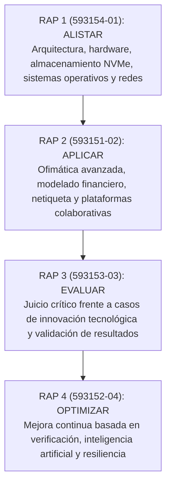

# 4. Planteamiento de Evidencias de Aprendizaje para la Evaluación en el Proceso Formativo

> **Formato Institucional:** GFPI-F-135 V04 — Guía de Aprendizaje  
> **Programa de Formación:** Análisis y Desarrollo de Software (Código: 228118)  
> **Competencia:** 220501046 - TIC (Utilizar herramientas informáticas de acuerdo con las necesidades de manejo de información)  

---

## Matriz General de Evaluación de la Competencia TIC

| Fase del Proyecto Formativo | Actividad del Proyecto Formativo | Actividad de Aprendizaje | Evidencias de Aprendizaje | Criterios de Evaluación Institucionales | Técnicas e Instrumentos de Evaluación | Documento de Evidencia Desarrollado |
| :--- | :--- | :--- | :--- | :--- | :--- | :--- |
| **Análisis** | Determinar las especificaciones funcionales del software. | **Alistar herramientas de Tecnologías de la Información y la Comunicación (TIC)**, de acuerdo con las necesidades de procesamiento de información y comunicación. | **Cuadro comparativo** de equipos TIC, periféricos, tecnologías de almacenamiento, sistemas operativos y servicios de Internet, alistados para el proyecto formativo. | • Identifica equipos TIC, tipos de software y servicios de Internet de acuerdo con las necesidades de uso. • Compara equipos TIC, tipos de software y servicios de Internet de acuerdo con sus características. • Escoge equipos TIC, tipos de software y servicios de Internet de acuerdo con las necesidades de procesamiento de información. | **Lista de chequeo.** | [03-actividad-3.2-cuadro-comparativo-tic.md](file:///C:/Users/User/Desktop/ADSO-3413974/02-training-project/01-phase/01-analysis/02-requirements/04-evidence-learning/guia_TIC/03-actividad-3.2-cuadro-comparativo-tic.md) |
| **Análisis** | Determinar las especificaciones funcionales del software. | **Aplicar funcionalidades de herramientas y servicios TIC**, de acuerdo con manuales de uso, procedimientos establecidos y buenas prácticas. | **Documento producido** con herramientas ofimáticas y publicado en la plataforma colaborativa, con sustentación oral grupal del eje temático asignado. | • Maneja computadores, periféricos y equipos móviles de acuerdo con sus funcionalidades. • Aplica funcionalidades de sistemas operativos de acuerdo con las necesidades de administración de los recursos del equipo. • Utiliza servicios de Internet de acuerdo con las necesidades de información y comunicación. | **Lista de chequeo.** | [04-actividad-3.3-ofimatica-y-colaboracion.md](file:///C:/Users/User/Desktop/ADSO-3413974/02-training-project/01-phase/01-analysis/02-requirements/04-evidence-learning/guia_TIC/04-actividad-3.3-ofimatica-y-colaboracion.md) |
| **Análisis** | Determinar las especificaciones funcionales del software. | **Evaluar los resultados**, de acuerdo con los requerimientos. | **Ensayo reflexivo de cine-foro** con la evaluación de los resultados obtenidos frente a los requerimientos del caso analizado. | • Comprueba el funcionamiento de los equipos, productos o servicios obtenidos con el uso de herramientas TIC, de acuerdo con los resultados esperados. | **Lista de chequeo.** | [05-actividad-3.3-cine-foro-ensayo-reflexivo.md](file:///C:/Users/User/Desktop/ADSO-3413974/02-training-project/01-phase/01-analysis/02-requirements/04-evidence-learning/guia_TIC/05-actividad-3.3-cine-foro-ensayo-reflexivo.md) |
| **Análisis** | Determinar las especificaciones funcionales del software. | **Optimizar los resultados**, de acuerdo con la verificación. | **Propuesta de solución tecnológica optimizada** tras la verificación, presentada y sustentada ante el grupo. | • Aplica procesos de mejora a los productos, de acuerdo con las comprobaciones realizadas. | **Lista de chequeo, sustentación.** | [06-actividad-3.4-propuesta-solucion-tecnologica.md](file:///C:/Users/User/Desktop/ADSO-3413974/02-training-project/01-phase/01-analysis/02-requirements/04-evidence-learning/guia_TIC/06-actividad-3.4-propuesta-solucion-tecnologica.md) |

---

## Síntesis de Resultados de Aprendizaje (RAPs) Vinculados

Todos los criterios de evaluación han sido plenamente satisfechos en los respectivos documentos técnicos desarrollados y organizados en esta carpeta.
