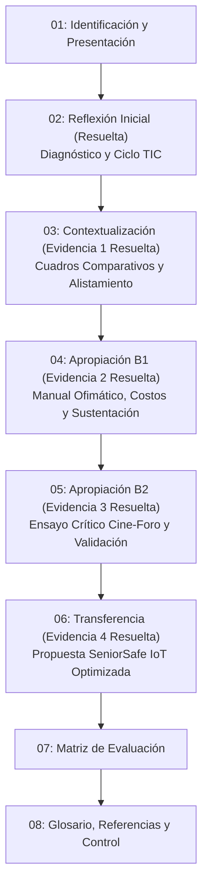

# Guía de Aprendizaje TIC — Módulo Integral Resuelto

> **Formato Institucional:** GFPI-F-135 V04 — Proceso de Gestión de Formación Profesional Integral  
> **Programa:** Análisis y Desarrollo de Software (Código: 228118)  
> **Proyecto Formativo:** Desarrollo de software orientado a servicios V2  
> **Fase:** Análisis | **Actividad de Proyecto:** Determinar las especificaciones funcionales del software  
> **Competencia:** Utilizar herramientas informáticas de acuerdo con las necesidades de manejo de información (Código Norma: **220501046 - TIC**)  
> **Duración Total:** 48 horas  

---

## Estructura del Módulo Unificado `guia_TIC`

En este directorio se encuentra el **contenido institucional completo de la Guía de Aprendizaje junto con el desarrollo y resolución técnica exhaustiva de cada una de las actividades y evidencias de aprendizaje**, organizado de manera modular en archivos Markdown (`.md`):

| Archivo | Sección de la Guía | Estado | Contenido y Entregables Resueltos |
| :--- | :--- | :---: | :--- |
| [01-identificacion-y-presentacion.md](file:///C:/Users/User/Desktop/ADSO-3413974/02-training-project/01-phase/01-analysis/02-requirements/04-evidence-learning/guia_TIC/01-identificacion-y-presentacion.md) | **Secciones 1 y 2** | Completo | Identificación formal de la guía, programa ADSO, competencia transversal, los 4 RAPs asociados y la justificación metodológica integrada. |
| [02-actividad-3.1-reflexion-inicial.md](file:///C:/Users/User/Desktop/ADSO-3413974/02-training-project/01-phase/01-analysis/02-requirements/04-evidence-learning/guia_TIC/02-actividad-3.1-reflexion-inicial.md) | **Sección 3.1** (2 h) | **Resuelto** | Lineamientos de la actividad, diagnóstico técnico del caso de pérdida de datos, respuestas exhaustivas a las 3 preguntas orientadoras y modelo de ciclo de vida TIC (*Alistar - Aplicar - Evaluar - Optimizar*). |
| [03-actividad-3.2-cuadro-comparativo-tic.md](file:///C:/Users/User/Desktop/ADSO-3413974/02-training-project/01-phase/01-analysis/02-requirements/04-evidence-learning/guia_TIC/03-actividad-3.2-cuadro-comparativo-tic.md) | **Sección 3.2** (8 h) | **Resuelto** | **Evidencia 1 (RAP 593154-01):** Cuadros comparativos exhaustivos de hardware, periféricos, almacenamiento masivo (HDD, SSD SATA, M.2 NVMe PCIe Gen 3/4/5), sistemas operativos y redes, más la ficha de alistamiento técnico oficial para el proyecto. |
| [04-actividad-3.3-ofimatica-y-colaboracion.md](file:///C:/Users/User/Desktop/ADSO-3413974/02-training-project/01-phase/01-analysis/02-requirements/04-evidence-learning/guia_TIC/04-actividad-3.3-ofimatica-y-colaboracion.md) | **Sección 3.3 Bloque 1** (18 h) | **Resuelto** | **Evidencia 2 (RAP 593151-02):** Manual de buenas prácticas ofimáticas, modelo financiero dinámico en hoja de cálculo con fórmulas avanzadas, netiqueta corporativa, nube RBAC y guion estructurado con cronograma para sustentación oral de 20 min. |
| [05-actividad-3.3-cine-foro-ensayo-reflexivo.md](file:///C:/Users/User/Desktop/ADSO-3413974/02-training-project/01-phase/01-analysis/02-requirements/04-evidence-learning/guia_TIC/05-actividad-3.3-cine-foro-ensayo-reflexivo.md) | **Sección 3.3 Bloque 2** (12 h) | **Resuelto** | **Evidencia 3 (RAP 593153-03):** Ensayo crítico completo *"De la Fricción de la Consola a la Ubicuidad Digital"*, evaluación de impacto en cuatro sectores (vida diaria, medicina, educación y transporte) y matriz de comprobación de resultados. |
| [06-actividad-3.4-propuesta-solucion-tecnologica.md](file:///C:/Users/User/Desktop/ADSO-3413974/02-training-project/01-phase/01-analysis/02-requirements/04-evidence-learning/guia_TIC/06-actividad-3.4-propuesta-solucion-tecnologica.md) | **Sección 3.4** (8 h) | **Resuelto** | **Evidencia 4 (RAP 593152-04):** Propuesta comunitaria *"SeniorSafe IoT"* para teleasistencia en adultos mayores solos: diseño base, sustentación, retroalimentación y optimización profunda (TinyML, batería extendida a 6 días y voz accesible). |
| [07-matriz-evaluacion-evidencias.md](file:///C:/Users/User/Desktop/ADSO-3413974/02-training-project/01-phase/01-analysis/02-requirements/04-evidence-learning/guia_TIC/07-matriz-evaluacion-evidencias.md) | **Sección 4** | Completo | Matriz institucional de evaluación SENA que relaciona fases, actividades de aprendizaje, criterios de evaluación, listas de chequeo y el mapeo de cada evidencia desarrollada. |
| [08-glosario-referencias-control.md](file:///C:/Users/User/Desktop/ADSO-3413974/02-training-project/01-phase/01-analysis/02-requirements/04-evidence-learning/guia_TIC/08-glosario-referencias-control.md) | **Secciones 5, 6, 7 y 8** | Completo | Glosario técnico enriquecido, referencias bibliográficas bajo norma IEEE/APA, datos de autoría institucional y registro en control de cambios. |

---

## Mapa de Flujo Metodológico

